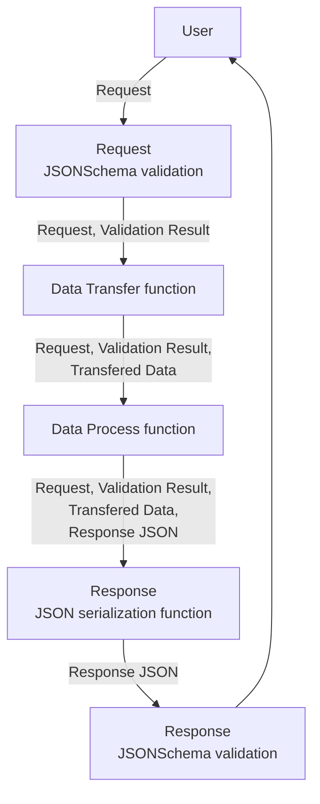

# Maeum
마음(Maeum)은 fastify.js를 사용한 간단한 프레임워크입니다. fastify.js 구조를 크게 변경하지 않으면서 여러가지 유용한 기능을 제공합니다. 마음은 다음과 같은 목표로 개발됩니다.

1. 클래스보다 함수를 사용한다
1. 비슷한, 동일한 일을 여러번 하지 않는다
1. 가능하면 자동화로 개발에 편의성을 보장한다

MVC 아키텍처는 성공적이며 가장 널리 사용하는 우수한 설계방식이지만 객체지향 설계라서 함수형 개발에는 어울리지 않는 부분이 있습니다. 또한 fastify.js 는 그 자체로 좋은 프레임워크 인터페이스이지만 MVC 아키텍처를 올릴 경우 프레임워크 인터페이스가 크게 달라지 것도 아쉬운점입니다. 마음은 되도록 원래 fastify.js 형태를 유지하고 다양한 자동화 기능을 제공하여 개발자 편의성을 도모하기 위해 개발하고 있습니다.

# Why fastify.js?
express.js는 좋은 프레임워크이지만 꽤 오랫동안 기능추가가 없었습니다. 또한 일반적으로 많은 상황에서 아쉬운 성능을 보여줄 때가 있습니다. 그외에도 async/await 지원이 아직 불완전한점, validation 지원이 없는점 등 다양한 부분에서 아쉬운점이 있습니다. koa.js는 express.js의 단점을 보완했지만 route 설정을 기본 기능으로 지원하지 않는 점등 역시 아쉬운점이 있습니다.

fastify.js는 express.js와 koa.js의 아쉬운점을 잘 보완한 unopinionated 웹 프레임워크 입니다. fastify.js라고 아쉬운점이 없는 것은 아니지만 현재까지는 좋은 모습을 보여주고 최근에 출시된 웹 프레임워크라서 기본 기능도 충실합니다. 또한 JSONSchema를 기본으로 지원하고, JSONSchema를 Swagger.io 문서로 자동으로 변환하는 등 프레임워크 자체 기능도 충실합니다. 그래서 마음(Maeum)은 fastify.js만 사용합니다. 다른 프레임워크를 지원하는 것은 아직까지는 예정에 없습니다.

# Request/Response flow
함수형 설계를 사용하기 때문에 Request는 함수의 흐름으로 처리됩니다. 우수한 MVC 아키텍처의 용어를 빌리지만 결과적으로는 함수형 프로그래밍에 가깝게 처리됩니다. Request/Response flow는 종국에는 [pipe operator](https://github.com/tc39/proposal-pipeline-operator)로 여러 함수가 하나의 함수로 결합되는 것을 목표로 합니다.


## Request JSONSchema validation
fastify.js에 JSONSchema를 등록하면 자동으로 처리됩니다. 정적 데이터 검증을 처리합니다.

## Data Transfer function
Database 또는 다른 RESTful API 서버 등에서 데이터를 가져오는 과정입니다. 어떤 방식으로든 다른 데이터 원천에서 데이터를 가져옵니다. MVC 아키텍처에서 DTO라고 불리는 단계입니다.

## Data Process function
응답하기 위해 데이터를 가공합니다. 응답하기 위해서 JSON을 만드는 과정은 아닙니다. 예를들면 Database에서 읽은 데이터 합산 결과를 추가하거나 분리된 URL을 결합하는 등의 일을 합니다.

## Response JSON serialization function
DTF, DPF를 거친 데이터를 Reponse JSON 형식으로 변환합니다.

## Response JSONSchema validation
fastify.js에 JSONSchema를 등록하면 자동으로 처리됩니다. 정적 데이터 검증을 처리합니다.

이러한 과정은 pipe operator으로 결합된다는 가정으로 개발합니다.

```ts
const healthHandler = dataTransferer |> dataProcessor |> serializer;
```

# Route
handler 디렉터리 파일구조를 그대로 라우팅 합니다. 라우팅을 위한 다양한 방법이 있지만 가장 직관적이며 대부분의 개발자가 쉽게 이해할 수 있습니다. fast-maker를 사용하여 디렉터리, 파일구조를 그대로 라우팅 설정으로 변경합니다. fast-maker는 ts-morph 패키지를 사용하여 handler 디렉터리 구조에 포함된 파일을 읽고 분석하여 RouteShorthandOptions 옵션을설정하고 FastifyRequest 객체의 type arguments 까지 이동시켜줍니다.

# Swagger
Maeum은 simple-tjscli를 사용하여 DTO 인터페이스를 json-schema로 자동으로 변경합니다. 이렇게 변경된 DTO 인터페이스는 @fastify/swagger 에 전달되며 json-schema를 사용하여 swagger 문서를 자동생성합니다. DTO 인터페이스만 작성하면 문서화, 검증이 자동으로 이뤄지므로 개발자는 문서 작성에 대한 부담없이 빠르게 원하는 로직을 개발하고 추가할 수 있습니다.

# validation
Maeum은 ts-json-schema-generator를 사용하여 DTO 인터페이스를 json-schema로 자동으로 변경합니다. 이 과정에서 jsDoc extended 옵션을 사용하며, document comment에 추가한 json-schema 설정 값을 json-schema로 자동으로 변환합니다.

# test
jest를 사용하여 testcase를 작성합니다. fastify에서 제공하는 inject 함수 및 e2e 테스트를 사용하여 간편하게 테스트를 작성할 수 있습니다.
