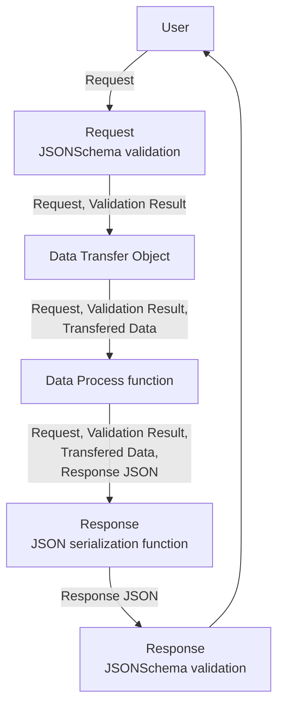

# Ma-eum

Maeum is RESTful API server boilerplate using [fastify.js](https://www.fastify.io/). Maeum don't implement wrapper function and don't change fastify.js architecture. Instead of change, static code generation using tool-chain. Maeum goal is below.

1. prefer use function
1. use static code generation and have to do static code analysis
1. effort consistency of DTO interface, validation, swagger document
1. effort more readable, more clear architecture
1. don't use wrapper function, don't change fastify architecture

## Why fastify.js?

express.js and koa.js, nest.js are good framework. But express.js don't support async/await handler(Also you can use by simple middleware implement or using [express-async-handler](https://github.com/Abazhenov/express-async-handler)). fastify.js show good performance and rich feature like json-schema validation, auto generate swagger document, etc. Also fastify.js is unopinionated web framework!

Maeum flow fastify.js architecture. And use fully fastify.js feature, for example json-schema validation and swagger documentation, routing. Maeum offer same way to same feature.

## Usage

```ts
# Clone the boilerplate:
git clone --depth=1 https://github.com/imjuni/maeum your-project-name

cd your-project-name
npm install

# run develop mode
npm run dev

# run develop mode with route, json-schema watch mode
npm run devs
```

## Mechanics

### Routing

Maeum auto generate route.ts file using directory structure. For example, `handler/get/v1/poke-detail` directory structure generated below.

```ts
export default function routing(fastify: FastifyInstance): void {
  fastify.get<IReqPokeDetail_vXR9OJd16Mi7ErFH2ubii3pmfPI8wKyi>(
    '/v1/poke-detail/:name',
    option_0subagxb2viNfout3Z8hQOjjpZPv5L8u,
    name_0subagxb2viNfout3Z8hQOjjpZPv5L8u,
  );
}
```

Maeum using [fast-maker](https://github.com/imjuni/fast-maker). fast-maker using TypeScript compiler API(via [ts-morph](https://ts-morph.com/)). fast-maker help to every developer working same way.

### Validation

Maeum using [simple-tjscli](https://github.com/imjuni/simple-tjscli). simple-tjscli using TypeScript compiler API(via [ts-morph](https://ts-morph.com/)). simple-tjscli generate json-schema using [ts-json-schema-generator](https://github.com/vega/ts-json-schema-generator). It using [chokidar](https://github.com/paulmillr/chokidar), watch your dto directory. If it detect add file or change file after generate json-schema. json-schema using for validation and swagger.io documentation. DTO interface conversion is powerfull mechanics keep consistency DTO interface and validation, swagger.io.

You can see auto generated json-schema [IReqPokeDetail](https://github.com/imjuni/maeum/blob/master/src/schema/v1/poke-detail/IReqPokeDetail.ts) and [IPokemon](https://github.com/imjuni/maeum/blob/master/src/schema/v1/poke-detail/IPokemon.ts).

### Swagger.io

Same mechanics validation.

### Test

Test using fastify.js e2e test function(= inject). You can see example [name.test.ts](https://github.com/imjuni/maeum/blob/master/src/handler/get/v1/poke-detail/__tests__/name.test.ts)

## Development flow

### Request/Response flow

Maeum flow functional architecture. Every functional stage will be integrate [pipe operator](https://github.com/tc39/proposal-pipeline-operator)



### Request JSONSchema validation

using json-schema. fastify.js do this stage.

### Data Transfer Object

using TypeScript interface.

### Data Process function

You have to do implement business logic like [that](https://github.com/imjuni/maeum/blob/master/src/module/v1/readPokeDetailByName.ts).

### Response JSON serialization function

You have to do implement business logic like [that](https://github.com/imjuni/maeum/blob/master/src/serializer/v1/serializerPokemonToWithTid.ts)

### Response JSONSchema validation

using json-schema. fastify.js do this stage.
